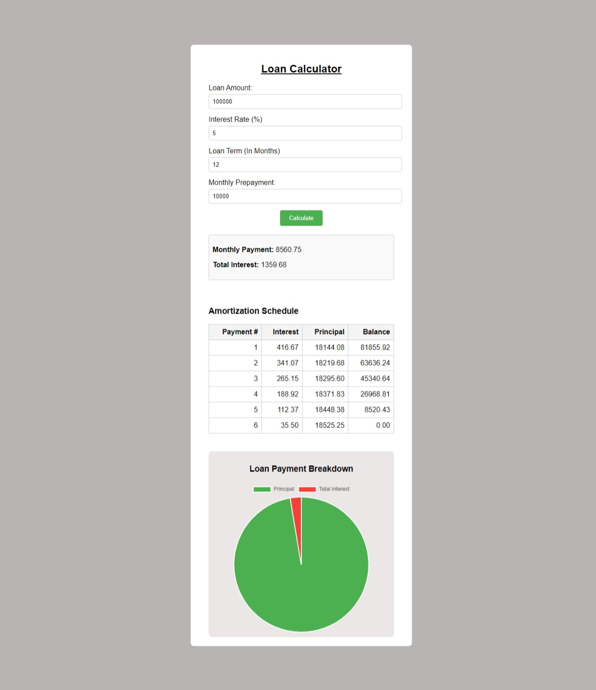

# 💰 Loan Calculator Application  

A responsive **Loan Calculator** web application that computes monthly loan payments, total interest, and generates an **amortization schedule**. Built with **HTML**, **CSS**, and **JavaScript**.  

---

## 🚀 Features  

- Calculate **monthly payments** based on loan amount, interest rate, loan term, and prepayments.  
- Displays a **detailed amortization schedule** with interest, principal, and balance.  
- Visualizes loan payment breakdown using a **pie chart**.  
- Responsive design for all devices.  

---

## 📸 Screenshot  



---

## 🛠️ Tech Stack  

- **HTML**: Markup for the structure.  
- **CSS**: Styling to enhance the UI.  
- **JavaScript**: Handles calculations and dynamic content generation.  
- **Chart.js**: For rendering the payment breakdown pie chart.  

---


## ⚙️ Installation  

To run the project locally, follow these steps:  

1. Clone this repository:  
   ```bash
   git clone https://github.com/muaz64/Loan-Calculator-app.git
   cd Loan-Calculator-app
   ```

2. Open the `index.html` file in your browser:  
   ```bash
   open index.html
   ```  

---

## 🧮 How It Works  

1. Input the following details:  
   - **Loan Amount**  
   - **Interest Rate (%)**  
   - **Loan Term (in Months)**  
   - **Monthly Prepayment (Optional)**  

2. Click the **Calculate** button to display:  
   - **Monthly Payment**  
   - **Total Interest**  
   - **Amortization Schedule** (Payment #, Interest, Principal, and Balance)  
   - A **pie chart** of principal and total interest breakdown.  

3. The **amortization schedule** dynamically updates based on the inputs.  

---

## 📡 Dependencies  

- **Chart.js**: Used for creating the pie chart in the loan breakdown section.  
   - [Chart.js Documentation](https://www.chartjs.org/)  

---

## 🧩 Project Structure  

```plaintext
loan-calculator-app/
│
├── index.html        # HTML structure  
├── style.css         # CSS styling  
├── script.js         # JavaScript logic  
├── chart.js          # Chart.js for graphs  
└── README.md         # Project documentation  
```

---


## 📝 License  

This project is **open-source** and free to use under the [MIT License](LICENSE).  

